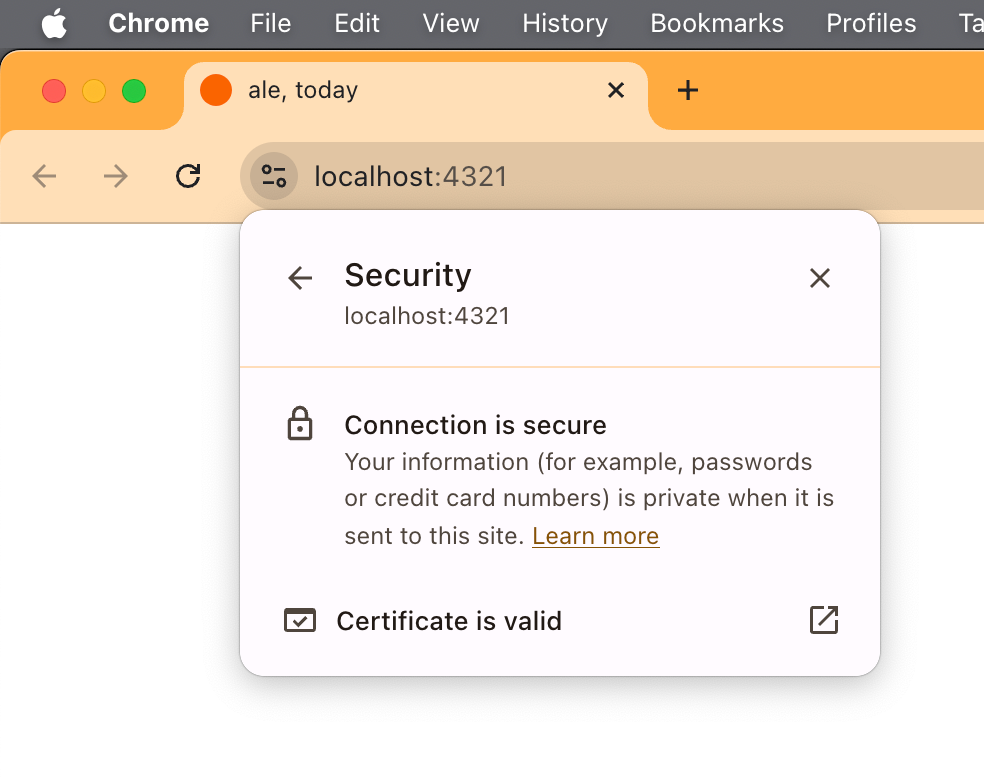

> This post is dedicated to [Yak Shaving](https://en.wiktionary.org/wiki/yak_shaving), the noble art of completing 75 side quests before doing the thing you actually wanted to get done.

Today, I wanted to add a simple feature to one of my side projects: the ability to copy a URL to the user's clipboard by clicking on a button.

That's apparently easy to implement [using the `Clipboard` API](https://developer.mozilla.org/en-US/docs/Web/API/Clipboard), but as it turns out, it doesn't work when you're serving your site via HTTP. They say it's for “security reasons” and I don't possess enough knowledge about the topic to start a discussion with the docs.

I could deploy my work in progress to a production site that uses HTTPS, like an animal, but that's not how I roll, so I decided to complicate my life and try to enable SSL on my local development environment.

What followed was a tour of many websites, blogs, Stack Overflow pages, and GitHub issues discussions. I want to ~~add some noise to the mix~~ save you the trouble if you find yourself in a similar predicament, so here's what I learnt, condensed and summarized.

For the record, I'm using Astro 5.7, but this should work for pretty much anything that uses Vite.

## Step 1: generating your certificates

To serve your development site via HTTPS, you'll need a pair of certificates. To generate them, we'll use `mkcert` to generate them for us:

```shell
cd your_astro_project
brew install mkcert
mkcert -install # This will ask for your admin password a few times
mkcert localhost
```

That will create a couple of files in your project's root: `localhost.pem` and `localhost-key.pem`.

> You may want to add those two files to your `.gitignore`, just in case.

## Step 2: tell Astro to use the certificates

To tell Astro to use our shiny certificates, add this to `astro.config.mjs`:

```js
import { defineConfig } from 'astro/config'

export default defineConfig({
 vite: {
   server: {
     https: {
       key: './localhost-key.pem',
       cert: './localhost.pem',
     },
   },
 },
})
```

## Step 3: profit

We can now run `astro dev` to start our development server, and it should automatically serve our content using SSL:

```shell
🍊  npm start

> ale.today@1.0.0 start
> astro dev

21:52:12 [types] Generated 0ms
21:52:12 [content] Syncing content
21:52:12 [content] Synced content

 astro  v5.7.10 ready in 498 ms

┃ Local    https://localhost:4321/
┃ Network  use --host to expose

21:52:12 watching for file changes...
```



Now we're ready for more ~~yak shaving~~ coding!

P.S: before you ask, yes, I finally got my clipboard code working with HTTPS 😎
